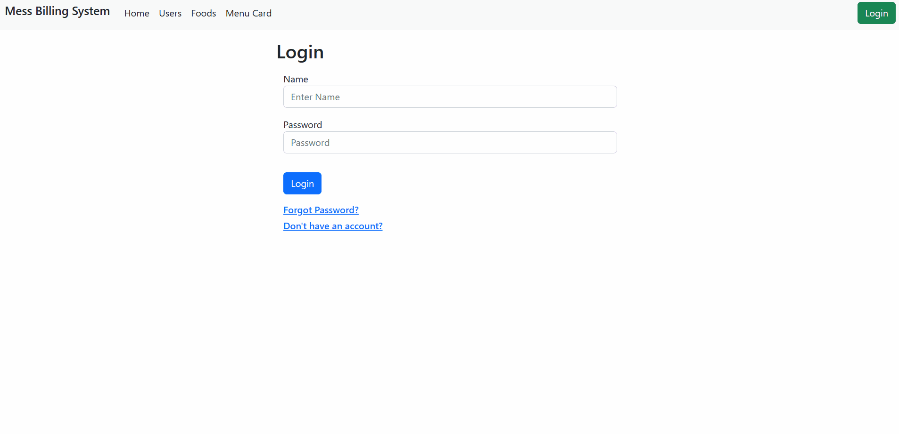

# Mess Billing Application

Mess Billing Application is a MERN stack application developed for internal use only. This application is deployed on web and used by us internally. 

MERN Stack is a compilation of four different technologies that work together to develop dynamic web apps and websites. It is a contraction for four different technologies as mentioned below:

- M - MongoDB
- E - ExpressJS
- R - ReactJS
- N - NodeJS

## Features 

1. A user can register using a username, image and password.
2. User can login using username and password.
3. User can view the list of users and foods available.
4. User can add a new meal on a certain date.
5. User can view the total bill for a particular date.
6. User can also delete any particular meal.
7. Admin will manage the application.
8. Admin can do all the operations for all users.
9. Admin can also add, modify and delete foods. 

## Languages & Frameworks 

- ReactJS
- NodeJS
- Mongoose
- MongoDB
- Express
- Javascript
- Bootstrap
- Cors
- Bcryptjs
- Dotenv
- Jsonwebtoken
- React-Dom
- React-Router-DOM

Visit <a href='https://mess-billing-system.onrender.com'>Mess Billing System Webpage </a>

### Demo

Below is a screenshot of how to add meals and delete meal using Admin account. Normal user will not have any option to select user.

